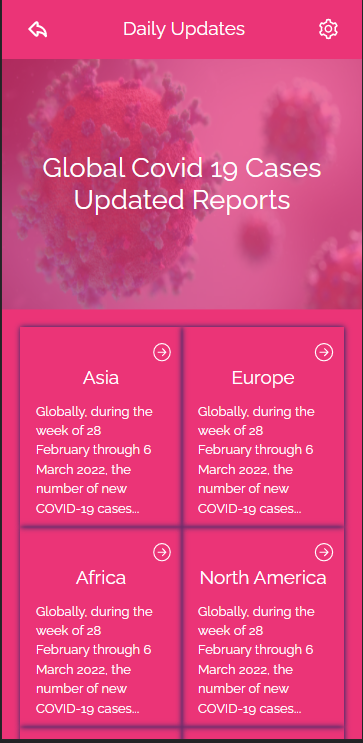

# Covid-19 Metrics



> Covid-19 Metrics Webapp is a web(mobile-focused) application for monitoring covid-19 recorded cases worldwide. It uses data from the Narrativa API.

## Presentation Video
Here is a video explaining what I have built [Here](https://www.loom.com/share/bec692eae1e04afebfbd702ea8c3bf0b)

## Live demo
[Covid-19 Metrics-App](https://covid-19-metrics-muwo.herokuapp.com/)

## Built With

- Frameworks / Libraries / Languages
  ```bash
  - React 
  - Redux
  - CSS
  - HTML
  - React Testing Library
  - Jest
  - Git
  - Linters
  ```


## Getting Started

To get a local copy up and running follow these simple example steps.

### Install
  -  [Git](https://git-scm.com/downloads)
  -  [Node](https://nodejs.org/en/download/)

### Usage
#### Clone this repository

```bash
$ git clone https://github.com/butlermuwo/Metrics-webapp.git
$ cd Metrics-webapp
```
#### Run project

```bash
$ npm install
$ npm start
```

👤 **Author: Butler Shimaluwani**

[<code></code>](https://github.com/butlermuwo)
[<code></code>](https://twitter.com/ButlerMuwo)
[<code></code>](https://www.linkedin.com/in/butlermuwo/)
 <a href="mailto:butlermuwo@gmail.com?subject=Hey Butler!"></a>

<!-- - GitHub: [@ButlerMuwo](https://github.com/butlermuwo)
- Twitter: [@ButlerMuwo](https://twitter.com/ButlerMuwo)
- LinkedIn: [@ButlerMuwo](https://www.linkedin.com/in/butlermuwo/) -->

## 🤝 Contributing

Contributions, issues, and feature requests are welcome!

Feel free to check the [issues page](../../issues/).

## Acknowledgement
Original design idea by [Nelson Sakwa on Behance..](https://www.behance.net/gallery/31579789/Ballhead-App-%28Free-PSDs%29) Under the [Creative Commons License](https://creativecommons.org/licenses/by-nc/4.0/)

## Show your support

Give a ⭐️ if you like this project!

## Acknowledgments

- Thanks to everyone that helped me, in one way or the other in building this awesome application.
## 📝 License

This project is [MIT](./MIT.md) licensed.